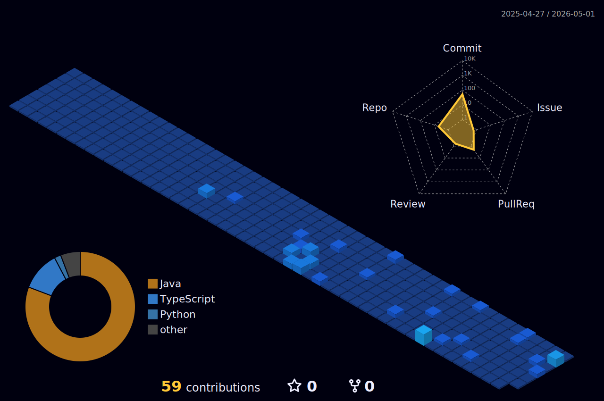

  
   
  

 

### 👨‍💻 A Little Bit About Me

<table>
  <tr>
    <td width="60%">
      <ul>
        <li>🎓 <b>Background:</b> 20-year-old Software Engineering student at HaUI, Hanoi.</li>
        <li>🎯 <b>Current Focus:</b> Architecting backend systems with <b>Java, Spring Boot</b> & <b>ReactJS</b>.</li>
        <li>🤖 <b>Exploring:</b> AI Engineering, Prompt Engineering, and AI agents.</li>
        <li>🛠️ <b>Style:</b> Building from scratch, writing clean & maintainable senior-level code.</li>
        <li>🎧 <b>Vibe:</b> Coding to Lo-fi beats, playing video games, and smashing shuttlecocks on the badminton court 🏸.</li>
      </ul>
    </td>
    <td width="40%" align="center">
      
    </td>
  </tr>
</table>

### 🧰 Tech Arsenal

**Backend & Databases**  
  

**Frontend & Tools**  

 

### 📈 GitHub Metrics

  
  

 

  

 

### 🏙️ 3D Coding Activity City

  

---

  <b>Let's Connect! 🤝</b>   
  
  

